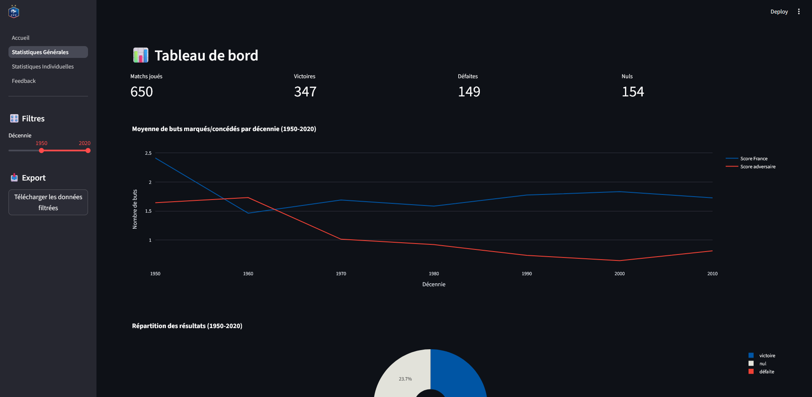
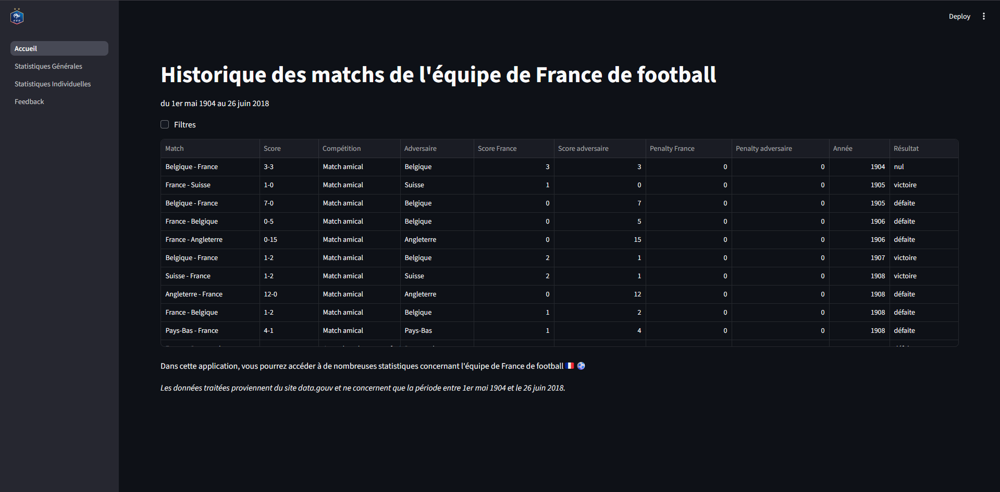
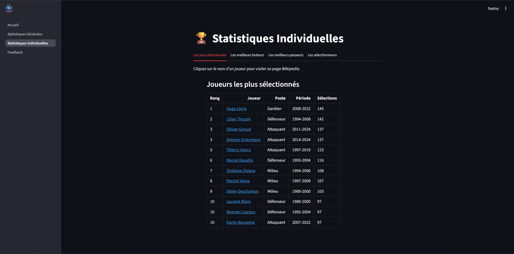
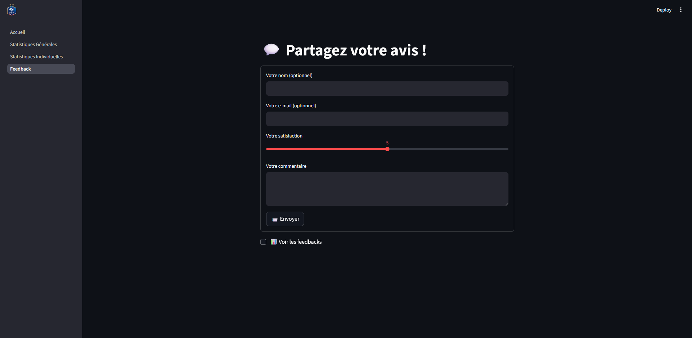

# projetPython

# 🇫🇷 Statistiques Historiques de l'Équipe de France de Football ⚽

Application interactive développée avec Streamlit et Python pour explorer l'historique complet des matchs, les performances globales et les statistiques individuelles des joueurs de l'équipe de France de football (1904 – 2018).

## 🌟 Fonctionnalités

Cette application permet d'accéder aux statistiques suivantes :

*   **Tableau de Bord Général :** Aperçu du nombre total de matchs joués, victoires, défaites et nuls. Analyse de la tendance des buts marqués et encaissés par décennie.
*   **Historique des Matchs :** Visualisation détaillée de chaque rencontre (Date, Adversaire, Compétition, Score, Résultat) avec possibilité d'appliquer des filtres.
*   **Statistiques Individuelles :** Classement des joueurs selon différents critères (Joueurs les plus sélectionnés, Meilleurs Buteurs, Meilleurs Passeurs).
*   **Exportation de Données :** Possibilité de télécharger les données statistiques affichées.
*   **Feedback :** Page dédiée pour recueillir les commentaires des utilisateurs.

## 🖼️ Aperçu de l'Application

## ⚙️ Installation et Démarrage

### Prérequis

Assurez-vous d'avoir Python (3.9+) installé sur votre système.

### Cloner et installer

'''bash
git clone https://github.com/btalib001/projetPython.git
cd projetPython
pip install -r requirements.txt

###🚀 Lancer l'application

'''bash
streamlit run Accueil.py

### 5. Source des Données et Limites

Pour les statistiques générales, le fichier csv est disponible à l'adresse suivante: https://www.data.gouv.fr/datasets/histoire-de-lequipe-de-france-de-football/
Les données couvrent la période entre le 1er mai 1904 et le 26 juin 2018 (non jusqu'à nos jours).
Pour les statistiques individuelles, les données sont issues de Wikipédia à l'adresse suivante: https://fr.wikipedia.org/wiki/%C3%89quipe_de_France_de_football

## 📝 Auteurs

Créé par : [Talib BATOU/btalib001, Antoine THEPAULT, AntoineThepault]
